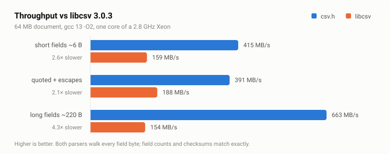

<p align="center">
  <picture>
    <source media="(prefers-color-scheme: dark)" srcset="docs/logo-dark.png">
    
  </picture>
</p>

<p align="center">
  <b>RFC 4180 CSV reader and writer. One C99 header. No allocation in the core.</b>
</p>

<p align="center">
  
  
  
  
  
  
</p>

## Why csv.h?

- **one C99 header** — nothing to build, configure or link
- **zero allocations in the core** — the reader and writer never call `malloc`
- **zero-copy** — fields are pointers into your buffer, not copies
- **streaming** — arbitrarily large files through a fixed window
- **RFC 4180 compliant**, plus the dialect knobs real-world files need
- **optional table API** for when you do want `malloc` to do the work
- **fuzzed and sanitizer-clean**, verified against csv-spectrum and Python's `csv`
- **MIT licensed**

```c
#define CSV_IMPLEMENTATION
#include "csv.h"

csv_reader rd;
csv_str    row[64];

csv_reader_init_mut(&rd, NULL, buf, len);    /* buf is yours; nothing is allocated */

csv_foreach_row (&rd, row, n)
    for (size_t i = 0; i < n; i++)
        printf("[" CSV_FMT "]", CSV_ARG(row[i]));
```

Copy `csv.h` into your tree. There is nothing to build, configure or link.

## Contents

- [Demo](#demo)
- [Rationale](#rationale)
- [Contract](#contract)
- [Reading](#reading)
  - [Mode 1 — a buffer you own](#mode-1--a-buffer-you-own)
  - [Mode 2 — a buffer you must not modify](#mode-2--a-buffer-you-must-not-modify)
  - [Mode 3 — streaming through a window](#mode-3--streaming-through-a-window)
  - [Object lifetimes](#object-lifetimes)
- [Writing](#writing)
- [Table layer](#table-layer-optional)
- [Dialects](#dialects)
- [Malformed input](#malformed-input)
- [Performance](#performance)
- [Footprint](#footprint)
- [Portability and configuration](#portability-and-configuration)
- [Verification](#verification)
- [API](#api)
- [Implementation notes](#implementation-notes)
- [Non-goals](#non-goals)
- [License](#license)

## Demo

`make demo`, or just `cc -std=c99 examples/demo.c -o demo && ./demo` — one
screen showing the whole surface: reading (BOM, quoted delimiters, escaped
quotes, multi-line fields, ragged rows), writing, error reporting and dialects.
The source is [`examples/demo.c`](examples/demo.c); this is its output:

```
== reading =====================================================
  columns: id=0 product=1 qty=3  (BOM was eaten: first header is "id")
  row 1 (4 fields): [1] [Widget, large] [says "hello"] [12]
  row 2 (4 fields): [2] [Gadget] [multi
line note] [7]
  row 3 (2 fields): [3] [Doohickey]   <- no qty in this row
  total qty: 19

== writing =====================================================
id,description
1,"needs, a comma"
2,"he said ""hi"""
  (53 bytes written, err=ok)

== errors ======================================================
  ok: 2 fields
  stopped at line 2, record 2, field 2: unterminated quoted field
  still failed on the next call: error

== dialects ====================================================
  tsv: [name] [city]
  tsv: [Ada] [Athens]
```

Everything in it is a dozen lines or less: the reading section is
`csv_reader_init_mut()` + `csv_foreach_row`, the writing section is
`csv_write_cstr()` + `csv_write_row_end()`, errors are read off the reader's
`err` / `line` / `row` / `col` fields, and the TSV dialect is one assignment to
`csv_opts.delimiter`. The sections below cover each in depth.

## Rationale

Plenty of CSV parsers exist. This particular combination is harder to find in
one place: plain C99 rather than C++ (the four CSV entries on the
`single_file_libs` list are all C++), a single header rather than a build
system, MIT rather than LGPL (`libcsv`, the best-known C implementation, is
LGPL-2.1 and autotools — awkward in a statically linked proprietary binary and
in most firmware), and no allocation unless you opt into it.

csv.h is aimed at that gap: one header, MIT, correct on the pathological
inputs, and it does not allocate unless you ask it to.

## Contract

| | |
| --- | --- |
| **Allocation** | none in the reader or writer, ever. `malloc` appears only in the optional table layer, which `-DCSV_NO_ALLOC` removes. |
| **Copying** | fields alias your buffer. Only `""` un-escaping writes bytes, and in-place mode writes them over the field itself. |
| **Mutation** | your input is `const` unless you opt in with `csv_reader_init_mut()`. |
| **Reentrancy** | no globals, no thread-local storage, no `errno`, no locale, no signals. Two threads, two `csv_reader` objects, no synchronisation. |
| **Complexity** | one pass, O(n) in document bytes. A short read re-parses at most one record. |
| **Stack** | ≤ 192 bytes per call, no recursion, no `alloca`, no VLAs. |
| **Failure** | sticky error code, never a `longjmp`, never an `abort`, never a partial write past a buffer end. |
| **Code size** | 5.4 KB of `.text` at `-Os` for reader + writer. |

## Reading

Three modes, distinguished only by who owns the bytes.

### Mode 1 — a buffer you own

The default choice. Un-escaping `""` strictly shortens a field, so when the
buffer is yours and writable the parser rewrites those fields in place. No
scratch, no allocation, nothing to size:

```c
csv_reader rd;
csv_str    row[64];
size_t     n;

csv_reader_init_mut(&rd, NULL, buf, len);

while (csv_next_row(&rd, row, 64, &n) == CSV_EVENT_ROW)
    handle(row, n);

if (rd.err)
    fprintf(stderr, "line %zu: %s\n", rd.line, csv_strerror(rd.err));
```

Fields remain valid as long as `buf` does — the whole document, not one record.
The mode needs the entire document up front, so it does not compose with
streaming; `csv_reader_feed()` asserts on that.

### Mode 2 — a buffer you must not modify

`mmap(PROT_READ)`, `.rodata`, a caller's const buffer. Give the parser scratch
for the fields that need un-escaping and it will leave your input alone:

```c
char       scratch[4096];
csv_reader rd;

csv_reader_init_buf(&rd, NULL, scratch, sizeof scratch, data, len);

for (csv_event e; (e = csv_next(&rd)) != CSV_EVENT_END; ) {
    if (e == CSV_EVENT_ERROR) break;
    if (e == CSV_EVENT_FIELD) use(rd.field);       /* {const char *ptr; size_t len} */
    if (e == CSV_EVENT_ROW)   end_of_record();
}
```

Only fields containing `""` touch the scratch. Pass `NULL, 0` if your data has
none; you get `CSV_ERR_NO_SPACE` rather than a surprise if you were wrong. The
scratch is a bump allocator rewound at each record, so it needs to hold the
widest record, not the file.

### Mode 3 — streaming through a window

The parser never buffers input. On a short read it reports how much of your
window it is finished with; you slide the tail down and refill:

```c
char   window[64 * 1024], scratch[64 * 1024];
size_t wlen = 0;
int    eof  = 0;

csv_reader_init(&rd, NULL, scratch, sizeof scratch);

while (!eof) {
    size_t got = fread(window + wlen, 1, sizeof window - wlen, fp);
    wlen += got;
    eof   = (got == 0);
    csv_reader_feed(&rd, window, wlen, eof);

    for (;;) {
        csv_str row[64];
        size_t  n, consumed;
        csv_event e = csv_next_row(&rd, row, 64, &n);

        if (e == CSV_EVENT_ROW)  { handle(row, n); continue; }
        if (e == CSV_EVENT_NEED_MORE) {
            consumed = csv_consumed(&rd);              /* == start of the open record */
            memmove(window, window + consumed, wlen - consumed);
            wlen -= consumed;
            break;
        }
        goto done;                                     /* END or ERROR */
    }
}
```

A record must fit in the window. `csv_consumed()` returning 0 on a full window
means this one does not — `realloc` and feed again. `examples/csvcat.c` does
exactly that, so it has no maximum record size; it has been run against a single
300 KB field through a 64 KiB initial window.

Refill in large chunks. The bytes of a partially seen record are re-parsed after
each refill: negligible at 64 KiB, quadratic if you refill a byte at a time.

`csv_next_row()` only ever hands you complete records, so it hides the retry. If
you drive `csv_next()` yourself, note that `CSV_EVENT_NEED_MORE` invalidates the
fields already emitted for the open record; they are re-emitted after the feed.

### Object lifetimes

Two rules:

1. A `csv_str` is valid until the next `csv_reader_feed()`.
2. And until the end of the current record, because the scratch is rewound per
   record. `CSV_FLAG_KEEP_SCRATCH` widens that to the whole parse; in-place mode
   gives it to you for free.

Nothing is NUL-terminated. Copy what you need to keep.

## Writing

```c
char       buf[4096];
csv_writer w;

csv_writer_init(&w, buf, sizeof buf, NULL);
csv_write_cstr(&w, "name");
csv_write_cstr(&w, "he said \"hi\", loudly");
csv_write_row_end(&w);
fwrite(buf, 1, w.len, stdout);
/* name,"he said ""hi"", loudly" */
```

A field is quoted when it must be — delimiter, quote, CR, LF, or a leading or
trailing blank — or always under `CSV_FLAG_QUOTE_ALL`.

On overflow the writer stops at the buffer end, sets `CSV_ERR_NO_SPACE`, and
keeps accumulating `w.needed`, so one retry with `needed` bytes always fits;
`snprintf` semantics. Or attach a sink and let it drain:

```c
csv_writer_sink(&w, csv_sink_file, stdout);   /* size_t (*)(void*, const char*, size_t) */
```

With a sink the buffer is just a staging area — a 4-byte one works, and writes
larger than the buffer bypass it entirely.

## Table layer (optional)

Removed wholesale by `-DCSV_NO_ALLOC`. The core above never references it.

```c
csv_table t;
if (csv_table_load(&t, "sales.csv", NULL) == CSV_OK) {
    size_t r;
    for (r = 1; r < t.nrows; r++)                        /* row 0 is the header */
        printf(CSV_FMT " x" CSV_FMT "\n",
               CSV_ARG(csv_table_get(&t, r, "product")),
               CSV_ARG(csv_table_get(&t, r, "qty")));
    csv_table_free(&t);
}
```

Ragged input is represented, not padded: `csv_table_ncols(&t, i)` is the real
width and `csv_table_at()` returns an empty field out of range instead of
indexing past the row. Four live allocations for a whole document — text,
un-escape arena, cell array, row index — and `csv_table_parse()` borrows your
buffer rather than copying it.

## Dialects

```c
csv_opts o = csv_opts_default();
o.delimiter  = '\t';     /* default ','                                    */
o.quote      = '\'';     /* default '"'                                    */
o.comment    = '#';      /* default off: skip records starting with it     */
o.escape     = '\\';     /* default off: accept `\"` as well as `""`       */
o.skip_lines = 2;        /* drop N physical lines of preamble              */
o.flags      = CSV_FLAG_TRIM | CSV_FLAG_SKIP_EMPTY;
```

| Flag | Effect |
| --- | --- |
| `CSV_FLAG_STRICT` | reject `a"b` and `"ab"cd` rather than accepting them |
| `CSV_FLAG_TRIM` | strip spaces and tabs around fields, never inside quotes |
| `CSV_FLAG_SKIP_EMPTY` | a blank line yields no record |
| `CSV_FLAG_NO_BOM` | keep a leading UTF-8 BOM instead of consuming it |
| `CSV_FLAG_KEEP_SCRATCH` | do not rewind the scratch between records |
| `CSV_FLAG_CRLF` | writer: terminate records with `\r\n` |
| `CSV_FLAG_QUOTE_ALL` | writer: quote unconditionally |

`escape` is a read-side option; the writer always doubles quotes, which every
dialect accepts. It is free when unset — the default scan never tests for an
escape byte.

## Malformed input

Production CSV is not RFC 4180. The default is to take the obvious meaning and
keep going:

| Input | Default | `CSV_FLAG_STRICT` |
| --- | --- | --- |
| `5" pipe,x` | `5" pipe` / `x` | `CSV_ERR_BARE_QUOTE` |
| `"ab"cd,x` | `abcd` / `x` | `CSV_ERR_TRAILING` |
| `"unterminated` | `CSV_ERR_UNTERMINATED` | `CSV_ERR_UNTERMINATED` |

Errors are sticky. `rd.err` stays set, `csv_next()` keeps returning
`CSV_EVENT_ERROR`, and `rd.line` / `rd.row` / `rd.col` locate the fault. Line
numbers count newlines inside quoted fields, so they refer to physical lines.

BOM consumption is deliberately lossy: a field whose first bytes are `EF BB BF`
loses them if it is later written back at offset 0. Set `CSV_FLAG_NO_BOM` for
byte-exact round trips.

## Performance

<picture>
  <source media="(prefers-color-scheme: dark)" srcset="docs/bench-dark.svg">
  
</picture>

`make bench-vs`. Both parsers walk the same 64 MB document and fold every field
byte into a checksum. gcc 13 `-O2`, one core of a 2.8 GHz Xeon, medians of five
runs on a shared VM — call it ±10%.

| Workload | csv.h | libcsv 3.0.3 | |
| --- | ---: | ---: | ---: |
| short fields, 8 cols × ~6 B | **415 MB/s** | 159 MB/s | 2.6x |
| quoted fields with `""` | **391 MB/s** | 188 MB/s | 2.1x |
| long fields, ~220 B | **663 MB/s** | 154 MB/s | 4.3x |

Field counts and checksums match libcsv exactly on all three, so the benchmark
doubles as a differential test over ~19 million fields.

Where the difference comes from: libcsv copies every field into an internal
buffer grown with `realloc` and calls back per field; csv.h returns a pointer
into memory you already have and only rewrites fields containing `""`. On long
fields it also scans with `memchr` instead of a per-byte state machine.

SIMD parsers in C++ reach several GB/s. If throughput is the only axis you care
about, use one of those — this is a scalar parser that happens to be quick.

## Footprint

`make measure`, on x86-64 with gcc 13:

```
per-instance state (no other allocation happens in the core):
  csv_str     16 B
  csv_opts    12 B
  csv_reader 392 B   (256 of it is the byte-class table)
  csv_writer  72 B
  csv_table   56 B

object size, -Os:
  reader+writer only   .text   5440 B
  everything           .text   6580 B

mutable global state:
  0000000000000000 d tab.6      <- const char *const error name table
  0000000000000040 d tab.7      <- const char *const event name table
  (.data.rel.ro under PIC: const pointer arrays that need relocation.
   .bss is empty. There is no writable global state.)

worst-case stack frame (gcc -fstack-usage; 'static' = no VLA, no alloca):
  csv_next_row                 192 B  static
  csv_next                     144 B  static
  csv_write                     80 B  static
```

A reader on the stack of a task with a 1 KB stack is fine. So is one in `.bss`
on a part with 2 KB of RAM, given a window to point it at.

## Portability and configuration

C99 or later; also compiles clean as C++11 and C++17. gcc, clang and MSVC.
Nothing outside `<stddef.h>`, `<limits.h>` and five `mem*` calls is required
once `CSV_NO_ALLOC` and `CSV_NO_STDIO` are set — no `<stdio.h>`, no `<stdlib.h>`,
no floating point, no 64-bit division, no atomics.

| Macro | Effect |
| --- | --- |
| `CSV_STATIC` | give every symbol internal linkage for a single-TU build |
| `CSV_API` | set linkage/visibility yourself (`__declspec(dllexport)`, `__attribute__((visibility))`) |
| `CSV_NO_ALLOC` | drop the table layer |
| `CSV_NO_STDIO` | drop `csv_table_load()` and `csv_sink_file()` |
| `CSV_ASSERT` | replace `assert()` |
| `CSV_MEMCPY` `CSV_MEMMOVE` `CSV_MEMCHR` `CSV_MEMCMP` `CSV_MEMSET` | replace `<string.h>` |
| `CSV_MALLOC` `CSV_REALLOC` `CSV_FREE` | replace `<stdlib.h>` |

Assertions mark caller contract violations — feeding a reader mid-record,
setting a delimiter equal to the quote — not input errors. Bad input is always a
returned `csv_error`. Compiling with `NDEBUG` is safe.

## Verification

```
make check         # everything below except fuzzing, ~40 s
make test          # 55k assertions
make spectrum      # csv-spectrum, 11/11, three parse modes each
make asan          # both suites under AddressSanitizer + UBSan
make strict        # -Werror as C99/C11/C17 and in every restricted config
make cxx           # C++11 and C++17
make multi         # two TUs, one implementation
make diff          # differential test against Python's csv module
make fuzz-run      # libFuzzer
make bench bench-vs measure
```

Four independent lines of evidence, because a parser is worth exactly what has
been thrown at it:

- **55k assertions.** Every table-driven case runs six times: whole buffer, then
  re-fed 1, 2, 3, 4 and 5 bytes at a time. A document must parse identically
  however it is sliced.
- **csv-spectrum 11/11.** The community acid-test corpus, vendored under
  `tests/spectrum/` and checked in all three modes — buffer, in-place, and
  streamed a byte at a time. `make spectrum-fetch` re-downloads it from upstream
  and diffs, so you need not take the vendored copies on trust.
- **libFuzzer**, asserting three properties per input: no crash,
  chunk-independence, and `parse → write → parse` identity. 16.3 M executions
  clean on the current tree (3 workers, ASan + UBSan, 1400-input corpus). It
  found two real defects during development, both fixed.
- **Differential testing** against Python's `csv` module over thousands of random
  hostile documents, and against libcsv over ~19 M fields in the benchmark.

Warning set, everywhere, with `-Werror`: `-Wall -Wextra -Wpedantic -Wshadow
-Wcast-qual -Wstrict-prototypes -Wmissing-prototypes -Wpointer-arith
-Wwrite-strings -Wconversion -Wsign-conversion -Wvla`.

## API

```c
/* reader */
void      csv_reader_init(csv_reader*, const csv_opts*, void *scratch, size_t);
void      csv_reader_init_buf(csv_reader*, const csv_opts*, void*, size_t,
                              const void *data, size_t len);
void      csv_reader_init_mut(csv_reader*, const csv_opts*, void*, size_t);
void      csv_reader_feed(csv_reader*, const void *data, size_t len, int final);
csv_event csv_next(csv_reader*);                       /* FIELD|ROW|END|NEED_MORE|ERROR */
csv_event csv_next_row(csv_reader*, csv_str *out, size_t cap, size_t *n);
size_t    csv_consumed(const csv_reader*);
size_t    csv_find(const csv_str*, size_t n, const char *name);

/* writer */
void      csv_writer_init(csv_writer*, void *buf, size_t cap, const csv_opts*);
void      csv_writer_sink(csv_writer*, csv_sink_fn, void *ctx);
csv_error csv_write(csv_writer*, const char*, size_t);
csv_error csv_write_str(csv_writer*, csv_str);
csv_error csv_write_cstr(csv_writer*, const char*);
csv_error csv_write_row(csv_writer*, const csv_str*, size_t);
csv_error csv_write_row_end(csv_writer*);
csv_error csv_writer_flush(csv_writer*);

/* table -- absent under CSV_NO_ALLOC */
csv_error csv_table_parse(csv_table*, const void*, size_t, const csv_opts*);
csv_error csv_table_load(csv_table*, const char *path, const csv_opts*);
csv_str   csv_table_at(const csv_table*, size_t row, size_t col);
csv_str   csv_table_get(const csv_table*, size_t row, const char *name);
size_t    csv_table_col(const csv_table*, const char *name);
size_t    csv_table_ncols(const csv_table*, size_t row);
void      csv_table_free(csv_table*);

/* misc */
const char *csv_strerror(csv_error);
const char *csv_event_name(csv_event);
csv_opts    csv_opts_default(void);
csv_str     csv_str_make(const char*, size_t);
int         csv_str_eq(csv_str, csv_str);
int         csv_str_eq_cstr(csv_str, const char*);
```

## Implementation notes

**Sliding window instead of internal buffering.** Internal buffering costs
either an allocation or a copy of every byte. Handing the window back to the
caller keeps the parser allocation-free and lets zero-copy survive streaming.
The price is re-parsing one partial record per refill.

**The state machine always sees a whole record.** On a short read the parser
rewinds to the record boundary rather than suspending mid-field, so there are no
cross-chunk continuation states — the entire class of "field split across a
chunk boundary" bugs does not exist to be tested for.

**Scratch is a per-record bump allocator.** That bounds it by the widest record
instead of the file, while keeping every field of a record valid at once, which
is the granularity callers actually iterate.

**A 256-byte class table, not `memchr`, for unquoted runs.** An unquoted field
ends at any of four byte values; `memchr` would need a pass per class, and real
fields are ~10 bytes. Inside quoted runs, where the terminator is a single byte
value and runs are long, `memchr` is used.

**`csv__field()` is force-inlined.** It has two call sites, the event loop and
the row loop, and letting the compiler decide costs ~15% on whichever one it
declines to inline into.

**X-macro tables for errors and events**, so the enum, the name table and the
message strings cannot drift apart.

## Non-goals

Type conversion, UTF-8 validation, locale, encoding transcoding, an index or a
query layer, and threads. This library turns bytes into fields; anything that
would need a decision about your data belongs on your side of the boundary.

Also not done, but not refused: SIMD scanning, `mmap` helpers, a Windows-1252 /
UTF-16 front end.

## License

MIT. Full text at the top of `csv.h`.
